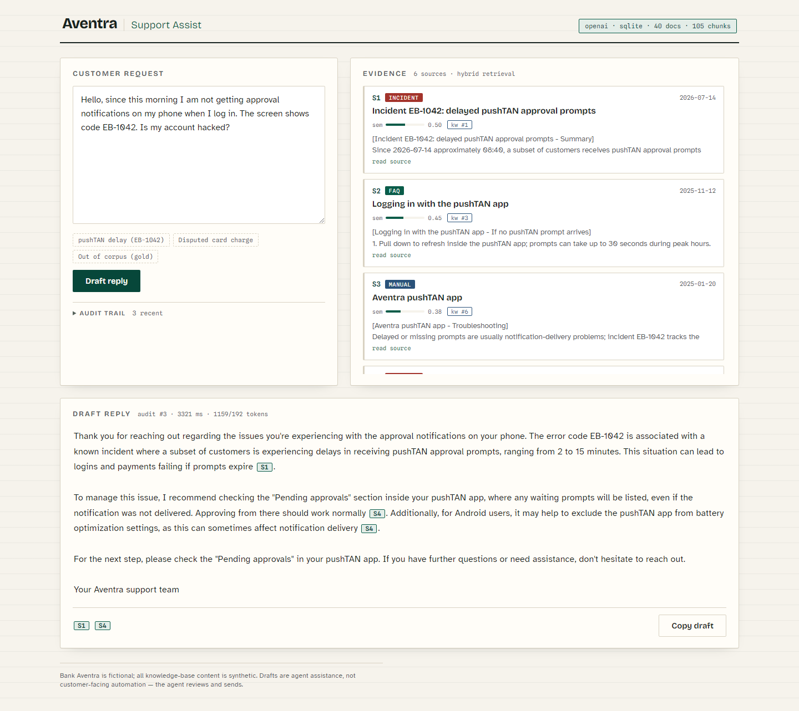
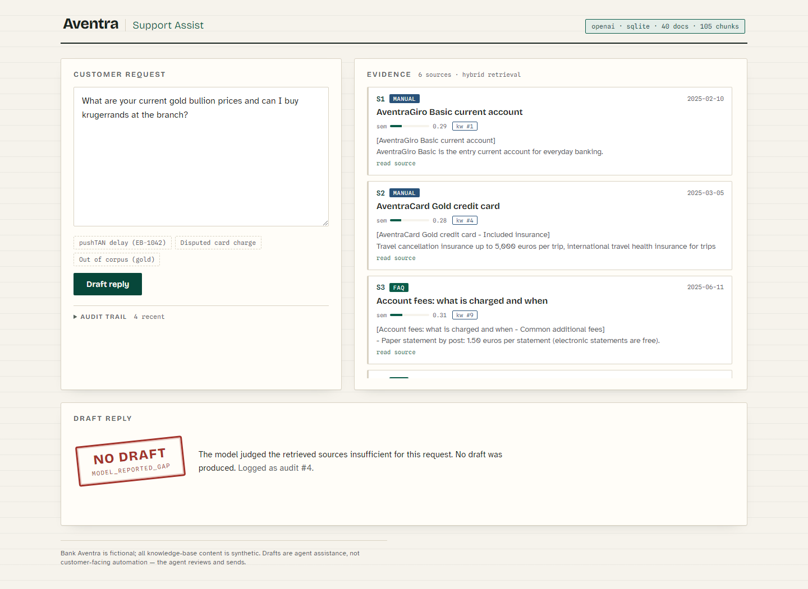

# Aventra Support Assist

An AI-powered assistant for **customer-support agents** at a mid-sized bank: it retrieves the
relevant knowledge (FAQs, product manuals, incident reports, internal procedures), shows the
evidence, and drafts a cited reply the agent reviews and sends. Built as a Capgemini case-study
submission (AI Solution Architect / AI Senior Engineer, Financial Services).



**Design stance in one sentence:** this is *agent assistance with governance*, not a customer-facing
chatbot — deterministic retrieval decides what the model may see, generation is fail-closed with
mandatory citations, refusals are explicit, and every request lands in an audit log.

> Bank Aventra is fictional. Every knowledge-base document in `corpus/` is synthetic and was written
> for this project. No real customer, bank, or personal data is used anywhere.

---

## Quickstart (~10 minutes)

Prerequisites: **Python 3.12+**, and either **Docker** (for the Postgres/pgvector path) *or*
nothing at all (SQLite fallback). Node is **not** required — the built UI is committed.

```bash
git clone <this-repo> && cd ai-support-assistant

# 1. Python environment
python -m venv .venv
# Windows: .venv\Scripts\activate     Linux/macOS: source .venv/bin/activate
pip install -r api/requirements.txt

# 2. Configuration
cp .env.example .env        # then set OPENAI_API_KEY — see "Model configuration" below

# 3. Database — pick ONE:
docker compose up -d        # (a) Postgres + pgvector on host port 5433  — primary path
                            # (b) or set DATABASE_URL=sqlite:///assist.db in .env — no Docker needed

# 4. Seed the knowledge base (chunks, embeds, and stores the 40 corpus documents)
cd api && python -m app.ingest && cd ..

# 5. Run
cd api && python -m uvicorn app.main:app --port 8000
```

Open **http://localhost:8000** — the agent workspace loads with three sample requests ready to try.

### Model configuration

The model substrate is the **OpenAI API** locally and **Azure OpenAI** in the target
architecture — the wire format is identical, so the move is an endpoint and credential change,
not a code change. Set `OPENAI_API_KEY` in `.env`; the models default to `gpt-4o-mini`
(drafting) and `text-embedding-3-small` (embeddings) and are configurable.

**Changing the embedding model requires re-seeding** (`python -m app.ingest`): embeddings from
different models live in incompatible vector spaces. The seed records the model and dimension,
and the API **refuses to serve** if the running embedding model disagrees with the seeded one —
a mismatched query must be a hard error, not a silently wrong answer.

---

## What the system does

1. **Hybrid retrieval.** Every request is searched two ways — semantic (embedding cosine) and
   keyword (full-text) — and the ranked lists are fused with Reciprocal Rank Fusion. Support
   corpora are full of exact tokens (`EB-1042`, product names) where pure vector search
   underperforms; the keyword leg pins those, the semantic leg handles paraphrase
   ("codes not arriving on my phone" → pushTAN incident).
2. **Deterministic evidence gate.** If the best evidence is weak (low similarity, no keyword hit),
   the request is refused *before* the model is ever called. The LLM never sees a question the
   corpus cannot support.
3. **Grounded, streamed drafting.** The model writes only from the numbered sources, cites after
   every claim (`[S1]`), and streams over SSE so the agent watches the draft form next to the
   evidence.
4. **Deterministic post-validation.** A draft with no citations, or citing sources that were not
   provided, is discarded — the agent sees an explicit refusal instead. A model-reported coverage
   gap (`COVERAGE_GAP`) becomes a refusal too.
5. **Audit trail.** Every request writes exactly one row: the query, the retrieved chunk ids with
   scores, the draft (or the discarded draft and the refusal reason), provider, model, latency,
   and token usage.



---

## Architecture

Cloud target (Azure), local demo topology, the component substitution table, the request flow, and
the SSE contract are in **[docs/architecture.md](docs/architecture.md)**. Design decisions are
recorded as ADRs in **[docs/adr/](docs/adr/)**:

| ADR | Decision |
|---|---|
| [001](docs/adr/001-agent-assist-not-customer-bot.md) | Agent-assist, not a customer-facing bot |
| [002](docs/adr/002-pgvector-over-vector-db.md) | pgvector in Postgres over a dedicated vector DB |
| [003](docs/adr/003-hybrid-retrieval-rrf.md) | Hybrid retrieval with Reciprocal Rank Fusion |
| [004](docs/adr/004-provider-gateway.md) | Model gateway: OpenAI API locally / Azure OpenAI in the cloud, raw HTTP |
| [005](docs/adr/005-fail-closed-grounding.md) | Fail-closed grounding, mandatory citations, audit log |

The same codebase runs in both environments; only configuration changes:

| Concern | Local demo | Azure target |
|---|---|---|
| Compute | `uvicorn` process | Container Apps |
| LLM + embeddings | OpenAI API | Azure OpenAI |
| Storage | Dockerized pgvector or SQLite | PG Flexible Server + pgvector |
| Documents | `corpus/` folder | Blob Storage + ingestion job |
| Auth | none (localhost) | Entra ID in front of the app |
| Secrets | `.env` | Key Vault |

---

## Evaluation

`eval/cases.json` holds 17 cases: 14 answerable (expected source documents + required draft
content) and 3 that **must** be refused (out-of-corpus topics). Checks are deterministic — no
LLM-as-judge — so runs are reproducible and directly comparable:

```bash
python eval/run_eval.py
```

Results (`gpt-4o-mini` + `text-embedding-3-small`, 2026-08-09):

| Metric | Result |
|---|---|
| Retrieval hit@6 | **14/14** |
| Draft rate (validated, cited) | **14/14** |
| Groundedness (required facts present) | **14/14** |
| Refusal handling (must-refuse cases) | **3/3** |
| Wall time | 50.5 s |

The checks are deterministic, so re-runs are directly comparable whenever models or retrieval
parameters change.

## Tests

18 unit tests cover the chunker, RRF fusion, the fail-closed guards, citation validation, and the
audit writes — all run without a database server or network:

```bash
cd api && python -m pytest
```

---

## Limitations and production roadmap

Deliberately out of scope for the case study, and what I would build next in production order:

1. **AuthN/AuthZ** — Entra ID (OIDC) in front of the app; per-agent identity in the audit log.
2. **PII redaction on ingestion and at the audit boundary** — customer messages contain personal
   data; redact before persistence, encrypt at rest, define retention.
3. **Reranking** — a cross-encoder reranker over the fused candidates once the corpus grows past
   a few thousand chunks; add hnsw index in pgvector at the same point.
4. **Feedback loop** — agent accept/edit/reject signals into the eval set; drift dashboards over
   the audit log (refusal rate, latency, groundedness over time).
5. **Document lifecycle** — incremental re-ingestion on document change instead of full re-seed;
   staleness metadata surfaced to the agent.
6. **Multilingual corpus** — German-first support corpus with a multilingual embedding model.

## Repository layout

```
api/            FastAPI app: config, storage (pgvector/SQLite), gateway, ingest,
                retrieval, assist, routes + 18 pytest tests
ui/             Vite + React agent workspace (built output committed to api/app/static)
corpus/         40 synthetic Bank Aventra documents (FAQ / manual / incident / procedure)
eval/           17-case deterministic evaluation harness
docs/           architecture.md, ADRs, DEMO_SCRIPT.md, screenshots
```

Fonts (Bricolage Grotesque, Atkinson Hyperlegible, Spline Sans Mono) are self-hosted under the
SIL Open Font License so the UI renders identically offline.