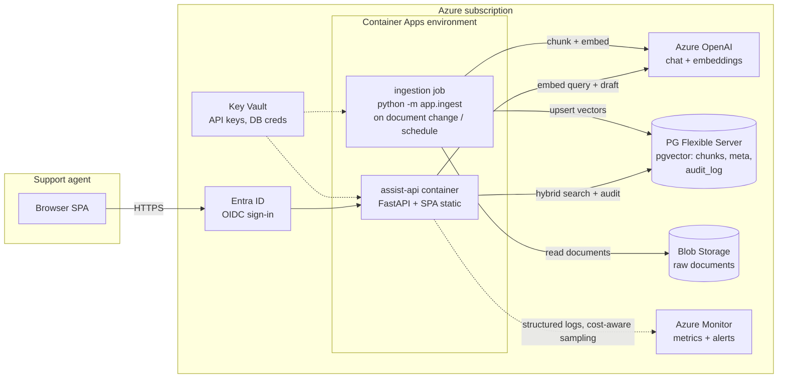
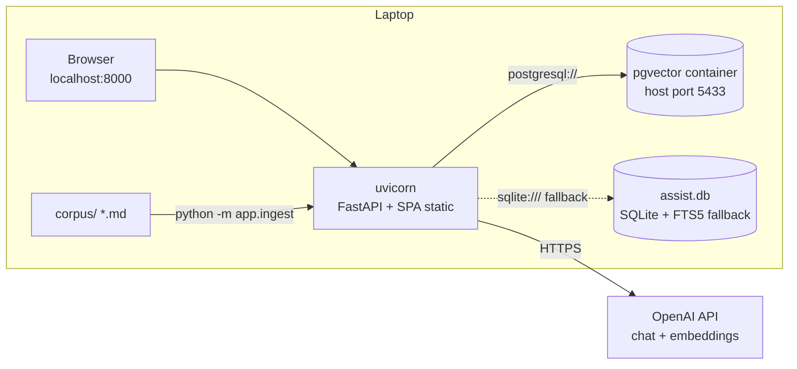
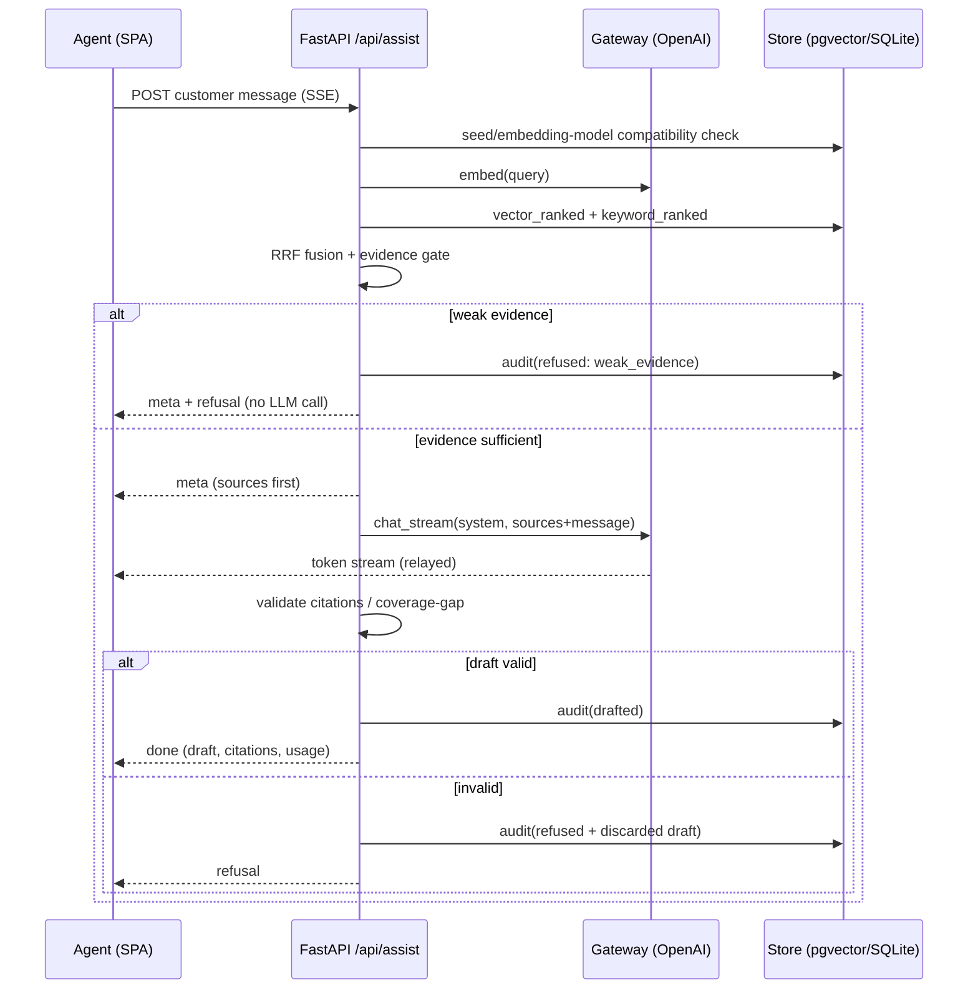

# Architecture

Two views of the same system: the **cloud target** the solution is designed for, and the **local
demo topology** it runs as on a laptop. The application code is identical in both — the
environments differ only in configuration (see the substitution table).

## Cloud target (Azure)



Notes an operator cares about:

- **One writable store.** Vectors, metadata, and the audit log live in the same Postgres — one
  backup story, one transaction boundary, no vector-DB vendor to onboard (ADR-002).
- **Ingestion is a job, not an endpoint.** Locally it is a CLI (`python -m app.ingest`); in the
  target it runs as a Container Apps job triggered by document changes. The API surface stays
  read-only towards the corpus by construction — there is deliberately no ingestion route.
- **Data residency.** All data-bearing services are region-pinned PaaS. With Azure OpenAI, prompts
  and completions are not used for training; for stricter regimes the gateway interface (two
  methods: embed, chat_stream) accommodates an in-environment model server with no caller changes.
- **Log costs.** Structured logs with sampling and a monthly budget alert — log ingestion is the
  classic silent cost driver in this stack.

## Local demo topology



### Component substitution table

| Concern | Local demo | Azure target | Switched by |
|---|---|---|---|
| Compute | `uvicorn` process | Container Apps | deployment |
| Chat + embeddings | OpenAI API | Azure OpenAI | endpoint + credentials |
| Vector + keyword store | pgvector container or SQLite | PG Flexible Server + pgvector | `DATABASE_URL` |
| Raw documents | `corpus/` folder | Blob Storage | ingestion job source |
| Auth | none (localhost) | Entra ID (OIDC) | reverse-proxy / middleware |
| Secrets | `.env` | Key Vault | environment |

The **storage fallback is the resilience story**: with Docker the demo runs on pgvector; without
Docker it falls back to SQLite + FTS5 behind the same store interface. Same code, same ranking
semantics, verified by the same tests — and the same adapter pattern is how an in-environment
model server would slot in behind the gateway for strict no-egress policies.

## Request flow (assist)



## SSE contract

`POST /api/assist` responds `text/event-stream`:

| Event | Payload | Meaning |
|---|---|---|
| `meta` | `{sources, weak}` | Retrieved evidence, sent before any generation |
| `token` | `{t}` | Draft text increment |
| `done` | `{audit_id, draft, citations, usage, latency_ms}` | Validated draft |
| `refusal` | `{reason, detail, audit_id}` | No draft: `weak_evidence`, `model_reported_gap`, `draft_missing_citations`, `draft_citation_invalid`, `retrieval_unavailable`, `gateway_unavailable`, `gateway_error` |
| `error` | `{detail}` | Infrastructure failure mid-stream |

## Data model

```
meta       key -> value(jsonb)      seeded (provider, model, dim, counts)
chunks     id, doc_id, doc_title, source_type, product, doc_date,
           chunk_index, content, embedding vector(dim), tsv (generated)
audit_log  id, ts, request_text, retrieved(jsonb), draft, refused,
           refusal_reason, provider, chat_model, latency_ms,
           prompt_tokens, completion_tokens
```

The `chunks` table is recreated on every seed (the corpus is the source of truth; the table is
derived state) with the embedding dimension of the active embedding model. Exact nearest-neighbour scan
is intentional at demo scale; an `hnsw` index is the documented next step once the corpus grows
(ADR-002).